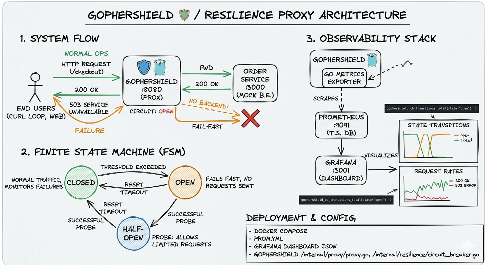

# GopherShield 🛡️ | High-Performance Resilience Proxy

GopherShield is a lightweight, high-performance reverse proxy built in Go, designed to protect microservices from cascading failures. By implementing the **Circuit Breaker** pattern and providing real-time **Prometheus** observability, it ensures system stability under high-load and unstable network conditions.

---

## 🏗️ System Architecture



*The diagram above illustrates the request flow, the three states of our Finite State Machine (FSM), and how telemetry data is scraped by Prometheus.*

---

## 🌍 Real-World Scenarios / Kullanım Senaryoları

### 🇬🇧 English
* **E-Commerce Payment Gateways:** During high-traffic events (Flash Sales), if a Bank API becomes latent, GopherShield trips the circuit. This prevents "Retry Storms" and keeps the checkout flow alive for other payment methods.
* **Microservice Isolation:** Prevents a failing non-critical service (e.g., "Product Recommendations") from exhausting the thread pool of the entire system, ensuring the "Add to Cart" path remains functional.
* **Third-Party API Reliability:** Shields your infrastructure from volatility when relying on external SMS, Shipping, or Map APIs.

### 🇹🇷 Türkçe
* **E-Ticaret Ödeme Sistemleri:** Kampanya dönemlerinde banka API'leri yavaşladığında, GopherShield devreyi açarak (trip) sistemin kilitlenmesini önler. "Retry Storm" oluşmasını engeller ve diğer ödeme yöntemlerinin çalışmaya devam etmesini sağlar.
* **Mikroservis İzolasyonu:** Kritik olmayan bir servisin (örneğin "Öneri Motoru") çökmesi durumunda, bu hatanın tüm sisteme yayılmasını (Cascading Failure) önler; "Sepete Ekle" gibi kritik fonksiyonların çalışmasını garanti altına alır.
* **Dış Servis Güvenliği:** SMS, kargo takibi veya harita gibi üçüncü parti API'lerdeki kesintilerin uygulamanızın kaynaklarını (CPU/RAM) tüketmesini engeller.

---

## 🏗️ Architecture & Logic


GopherShield operates using a **Finite State Machine (FSM)** with three distinct states:
1.  **Closed:** Requests flow normally to the upstream service.
2.  **Open:** Upstream is failing. Requests are rejected immediately (Fail-Fast) to preserve resources.
3.  **Half-Open:** A probe state to check if the upstream service has recovered.

---

## 🚀 Tech Stack

* **Go 1.25+**: High-concurrency primitives and `sync.RWMutex` for low-latency thread safety.
* **Prometheus**: Real-time metrics tracking for circuit state transitions.
* **Docker & Docker Compose**: Production-grade multi-stage containerization.
* **Reverse Proxy**: Built-in Go `httputil` logic with custom error handling.

---

## 📊 Observability (Prometheus)

The proxy exposes metrics on port `:9090/metrics`.
* **Metric Name:** `gophershield_cb_transitions_total`
* **Labels:** `state=["open", "closed"]`

This allows SRE teams to monitor exactly when and why a circuit was tripped in production dashboards like Grafana.

---

## 🚦 Getting Started

### Prerequisites
- Docker & Docker Compose
- Go 1.25 (for local testing)

### Quick Start
1.  **Clone & Build:**
    ```bash
    git clone [https://github.com/bartukocakara/gopher-shield.git](https://github.com/bartukocakara/gopher-shield.git)
    cd gopher-shield
    go mod tidy
    docker-compose up --build
    ```

2.  **Test the Proxy:**
    ```bash
    curl http://localhost:8080
    ```

3.  **Simulate Failure:**
    ```bash
    docker stop gopher-shield-mockserver-1
    # Send 3+ requests to trip the circuit
    for /l %i in (1,1,100) do @(curl -s http://localhost:8080/checkout && echo. & timeout /t 1 >nul)
    ```

4.  **Monitor via Prometheus:**
    Visit `http://localhost:9091` and query `gophershield_cb_transitions_total`.

---

## 🛡️ Important Features
* **Thread-Safe State Management:** Uses Read-Write Mutexes to ensure zero-bottleneck state checks under high concurrency.
* **Decoupled Resilience Logic:** The Circuit Breaker is implemented as a standalone package, making it reusable for DB calls, gRPC, or HTTP.
* **Fail-Fast Mechanism:** Reduces latency for end-users during downstream outages.

---

### 🛡️ Resilience Metrics in Action
The system has been verified to handle the full lifecycle of a failure:
1. **Detection:** Instant transition to `OPEN` state on failure threshold.
2. **Protection:** 100% Fail-fast response during downtime.
3. **Recovery:** Automatic transition to `HALF-OPEN` after `resetTimeout`, and seamless return to `CLOSED` state once the upstream service (Order Service) is healthy.

---

## 📈 Observability & Monitoring

GopherShield provides a full observability stack:
- **Prometheus:** Scrapes state transitions every 15 seconds.
- **Grafana:** Visualizes the health of the circuit breaker.
  - **URL:** `http://localhost:3001` (admin/admin)
  - **Key Metric:** `gophershield_cb_transitions_total` helps identify unstable downstream services.

---

### 🛍️ E-commerce Checkout Case Study
In this project, GopherShield sits in front of the `/checkout` route. 
- **The Challenge:** Payment providers often suffer from latency during peak sales. 
- **The Solution:** GopherShield monitors the `/checkout` success rate. If the payment gateway fails 3 times, the circuit opens, preventing the entire site from slowing down and allowing users to be notified immediately that payments are temporarily down, rather than leaving them with a hanging "Loading" screen.

---
Developed by [Bartu Kocakara](https://github.com/bartukocakara)